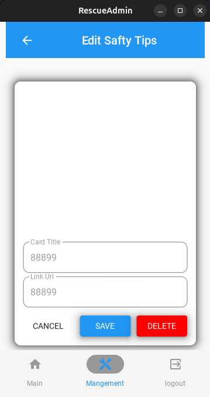

# 🚨 Rescue App

**Rescue App** คือแอปพลิเคชันมือถือที่พัฒนาด้วย **KivyMD** และ **Python** สำหรับการรายงานเหตุฉุกเฉิน แอปนี้ช่วยให้ผู้ใช้สามารถส่งรายงานเหตุด้วยการถ่ายภาพและตำแหน่ง โดยอ้างอิงข้อมูลตำแหน่งมาจาก Public IP เก็บข้อมูลลงใน **MongoDB** พร้อมทั้งแนะนำวิธีการช่วยเหลือผู้ประสบภัย และอธิบายสัญลักษณ์กู้ภัยต่าง ๆ อย่างละเอียด

---

## 📌 คุณสมบัติเด่น

- 📍 **รายงานเหตุฉุกเฉิน:**

  - ถ่ายภาพเหตุการณ์และส่งพร้อมข้อมูลตำแหน่ง Public IP
  - เก็บและจัดการข้อมูลใน MongoDB อย่างมีประสิทธิภาพ

- 🗺️ **แผนที่:**

  - แสดงตำแหน่งของเหตุการณ์บนแผนที่

- 🛟 **คำแนะนำการช่วยเหลือ:**

  - ขั้นตอนการช่วยเหลือผู้ประสบภัยในสถานการณ์ต่าง ๆ
  - อธิบายสัญลักษณ์กู้ภัยและความหมาย

- 🔒 **ระบบยืนยันตัวตน:**
  - ระบบลงทะเบียนและเข้าสู่ระบบที่ปลอดภัย
  - แบ่งสิทธิ์การเข้าถึงระหว่างผู้ใช้ทั่วไปและผู้ดูแลระบบ

---

## 🛠️ เทคโนโลยีที่ใช้

- **Frontend:** KivyMD (Material Design สำหรับ Kivy)
- **Backend:** Python และ MongoDB
- **ฐานข้อมูล:** MongoDB สำหรับจัดเก็บรายงานและข้อมูลผู้ใช้
- **WebCam** openCV2 สำหรับให้งานกล้อง และจัดเก็บใน MongoDB
- **GPS** kivy_garden สำหรับโชว์แผนที่ และตำแหน่งปัจจุบัน

---

## 📂 โครงสร้างโปรเจค

```
RESCUE-APP/
├── fonts/
├── Image/
├── kivy_env/
├── rescue_screen/
├── test_function/
├── main_kivyMD.py
├── .gitignore
└── README.md
```

---

## ⚙️ การติดตั้งและใช้งาน

### 1. Clone โปรเจค:

```bash
git clone https://github.com/PunPK/Rescue-App.git
cd Rescue-App
```

### 2. ติดตั้ง Dependencies:

**สำหรับ macOS และ Linux**

```bash
python3 venv kivy_env
source kivy_env/bin/activate
```

### 3. ติดตั้งแพ็กเกจเพิ่มเติม:

```bash
pip install kivyMD
pip install pymongo
pip install kivy
pip install kivy_garden
pip install gridfs
pip install opencv2
```

### 4. ตั้งค่า MongoDB:

```python
MongoClient("localhost", 27017)
# ใช้งานผ่าน localhost 27017
```

### 5. รันแอป:

```bash
python main_kivyMD.py
```
## 🛠️ Functions:

### 1. หน้าการใส่หน้าและการรันหน้าของแอป ได้แบ่งเป็น 2 ฝั่ง

**1. ผู้ใช้งานยังไม่ได้ Login**
```python
class RescueApp(MDApp):
    def build(self):
        self.theme_cls.primary_palette = "Blue"
        self.theme_cls.primary_hue = "900"

        self.screen_manager = MDScreenManager() # ตั้งค่า Screen สำหรับการจัดการ Screen

        main_screen = MainScreen(name="main") # ใช้ Function MainScreen ตั้งค่าเป็นหน้าแรก
        self.screen_manager.add_widget(main_screen) # ดึงหน้า main มาใส่ใน screen_manager
        self.screen_manager.add_widget(ReceiverScreen(name="receiver")) # เรียกใช้ class ของหน้า และตั้งชื่อหน้า
        self.screen_manager.add_widget(LoginScreen(name="login"))
        self.screen_manager.add_widget(RegistrationScreen(name="register"))
        self.screen_manager.add_widget(Ruem_ber(name="officer"))
        self.screen_manager.add_widget(MyDevelop(name="mydevelop"))
        self.screen_manager.add_widget(ApplicationInfoScreen(name="applicationinfo"))
        self.screen_manager.add_widget(MapViewScreen(name="mapview"))
        self.screen_manager.add_widget(Tips_page(name="tipsview"))
        self.screen_manager.add_widget(SymbolScreen(name="symbolview"))
        self.screen_manager.current = ตั้งค่า หน้าแรกเป็น main ซึ่งคือ MainScreen สำหรับเมื่อเปิดแอปมาครั้งแรก

        return self.screen_manager
```

**2. ผู้ใช้งานที่ Login และเป็น Role: Admin**
```python
class RescueAdminApp(MDApp):
    def build(self):
        self.theme_cls.primary_palette = "Blue"
        self.theme_cls.accent_palette = "Amber"
        self.root = Builder.load_string(KV) # ดึงไฟล์ KV มาใช้งาน
        self.screen_manager = self.root.ids.screen_manager

        self.screen_manager.add_widget(ReportList(name="home-admin")) # เรียกใช้ class ของหน้า และตั้งชื่อหน้า
        self.screen_manager.add_widget(ReportDetailsScreen(name="reports-detail"))
        self.screen_manager.add_widget(Tool_page(name="tool-page"))
        self.screen_manager.add_widget(Card_page(name=("card-page")))
        self.screen_manager.add_widget(CreateCardScreen(name=("create_card")))
        self.screen_manager.add_widget(EditCardScreen(name=("edit_card")))
        self.screen_manager.add_widget(Tips_page(name=("tips-page")))
        self.screen_manager.add_widget(CreateTipScreen(name=("create_tip")))
        self.screen_manager.add_widget(EditTipScreen(name=("edit_tip")))
        self.screen_manager.add_widget(MyAdminDevelop(name=("view-develop")))
        # Set initial screen AFTER adding screens
        self.screen_manager.current = "home-admin" ตั้งค่า หน้าแรกเป็น home-admin ซึ่งคือ ReportList สำหรับเมื่อ login เข้ามา

        return self.root
```

### 2. Function Login

**1. การเรียกใช้งาน DataBase**

```python
from pymongo import MongoClient, errors

client = MongoClient("localhost", 27017) # เชื่อมต่อ MongoDB localhost 27017
db = client["rescue_app"] # เรียกใช้ ฐานข้อมูลใน DataBase MongoDB
users_collection = db["users"] # ตั้งชื่อ collection users MongoDB

# ตรวจสอบและสร้างข้อมูลผู้ใช้และรายงานหากไม่มี
if users_collection.count_documents({}) == 0:
    users_collection.insert_many(
        [
            {"username": "admin", "password": "admin123", "role": "admin"}, # สร้าง User เริ่มต้น
        ]
    )
```

**2. การเรียกใช้งาน Font**

```python
LabelBase.register(name="ThaiFont", fn_regular="fonts/THSarabunNew.ttf") # ลง font และตั้งชื่อ Font เป็น ThaiFont
```

**3. LoginScreen.py**
```python
class LoginScreen(MDScreen):
    def login(self):
        username = self.ids.username_input.text #รับค่าซึ่งดึงข้อมูล id username_input จาก .kv
        password = self.ids.password_input.text #รับค่าซึ่งดึงข้อมูล id password_input จาก .kv

        user = users_collection.find_one({"username": username})

        if user and user["password"] == password: # ตรวจสอบว่า User และ Password มีครบ
            role = user["role"]
            if role == "admin": # ถ้าเป็น role Admin
                # Switch to admin app
                MDApp.get_running_app().switch_to_admin_app() # ดึงข้อมูลแอปที่รันอยู่ และจะเรียกใช้ switch_to_admin_app() ใน main_kivyMD.py

        self.ids.username_input.text = "" # ล้างข้อมูลจาก id username_input ของ .kv
        self.ids.password_input.text = "" # ล้างข้อมูลจาก id password_input ของ .kv
```
**4. Screen.kv**
```kv
                TextInput:
                    id: username_input # ตั้งชื่อ ID สำหรับไปเรียกใช้ใน .py
                    hint_text: 'ชื่อผู้ใช้'
                    font_name: 'ThaiFont' # เรียกใช้งาน font จากที่ตั้งค่าไว้ใน .py

                TextInput:
                    id: password_input 
                    hint_text: 'รหัสผ่าน'
                    font_name: 'ThaiFont'
```
**5. main_kivyMD.py**
```python
def switch_to_admin_app(self):
        self.stop() # หยุดการใช้งาน App ปัจจุบัน 
        from admin_kivyMD import RescueAdminApp # ดึง App ของ Admin มา
        RescueAdminApp().run() # รัน App ของ Admin แทน
```

### 3. Function Logout

**1. admin_kivyMD.py  (KV)**
```kv
MDBottomNavigationItem:
            name: 'nav_logout'
            text: 'logout'
            icon: 'logout-variant'
            on_tab_press: app.switch_to_user_app() # เรียกใช้งาน RescueAdminApp -> switch_to_user_app
```
**2. admin_kivyMD.py**
```python
class RescueAdminApp(MDApp): 
    def switch_to_user_app(self):
        self.stop() # หยุดการใช้งาน App ปัจจุบัน 
        from main_kivyMD import RescueApp # ดึง App ของ User มา
        RescueApp().run() # รัน App ของ User แทน
```

### 4. Functions Create Edit Delete Number Info

**1. การเรียกใช้งาน DataBase**

```python
from pymongo import MongoClient, errors
client = MongoClient("localhost", 27017)  # เชื่อมต่อ MongoDB localhost 27017
db = client["rescue_app"] # เรียกใช้ Data Base MongoDB
numbers_info_collection = db["numbers_info"] # ตั้งชื่อ numbers_info_collection MongoDB
```

**2. หน้าแสดง Crad เพื่อโชว์ข้อมูล Number**
```python
class Card_page(MDScreen):
    def load_cards(self): # Load การ์ด ทั้งหมด
        self.card_list.clear_widgets()
        numbers_info_data = numbers_info_collection.find() ค้นหาข้อมูล Crad ใน mongodb

        for i in numbers_info_data: # loop การแสดงผลข้อมูลการ์ด
            item = TwoLineListItem(
                text=f"Phone Number: {i['phone_number']}", # ดึง phone_number ใน collection มาแสดงผล
                secondary_text=f"Agency: {i['agency']}", # ดึง agency ใน collection มาแสดงผล
                on_release=lambda x, i=i: self.edit_card(i), # เพิ่มให้สามารถกดปุ่มแล้วจะสามารถ Edit ได้
            )
            self.card_list.add_widget(item)
```


**3. หน้า Create Crad เพื่อโชว์ข้อมูล Number**
```python
class CreateCardScreen(MDScreen):
    def save_card(self, instance):
        title = self.title_field.text
        phone_number = self.phone_number_field.text
        data = {"agency": title, "phone_number": phone_number} # ดึงข้อมูลมาเก็บไว้
        numbers_info_collection.insert_one(data) # นำเข้า DataBase

        self.manager.current = "card-page"
        self.manager.get_screen("card-page").load_cards() # กลับไปหน้า card-page และ fetch ข้อมูลให้ตรงตาม DataBase
```

**4. หน้า Edit Delete Crad เพื่อโชว์ข้อมูล Number**
```python
class Card_page(MDScreen):
    def edit_card(self, card_data): # เมื่อมีการกด Edit Card จะเรียกใข้งาน Function
        self.manager.get_screen("edit_card").set_card_data(card_data) # ไปยังหน้า edit_card พร้อมทั้ง set ข้อมูลที่จะส่งไปด้วย แต่ที่จะสามารถแก้ไขได้
        self.manager.current = "edit_card" # สลับหน้าไปยังหน้า Edit

class EditCardScreen(MDScreen):
    def set_card_data(self, card_data):
        self.card_data = card_data
        self.title_field.text = card_data["agency"] # ดึงข้อมูลมาเก็บไว้ 
        self.phone_number_field.text = card_data["phone_number"] # ดึงข้อมูลมาเก็บไว้ 

    def save_card(self, instance): # กด save ข้อมูล crad
        title = self.title_field.text # ดึงค่า title_field และมาแปลงเป็น text
        phone_number = self.phone_number_field.text # ดึงค่า phone_number_field และมาแปลงเป็น text
        numbers_info_collection.update_one( # เก็บข้อมูลใน collections
            {"_id": self.card_data["_id"]}, # เลือกที่ id ตรงกัน และส่งค่าข้อมูลไป
            {"$set": {"agency": title, "phone_number": phone_number}}, # ดึง title ของ phone_number มาเก็บใน Database 
        )

        self.manager.current = "card-page"
        self.manager.get_screen("card-page").load_cards() # กลับไปหน้า card-page และ fetch ข้อมูลให้ตรงตาม DataBase
```


**5. หน้า Delete Crad เพื่อโชว์ข้อมูล Number**
```python
class EditCardScreen(MDScreen):
    def delete_card(self, instance):
        numbers_info_collection.delete_one({"_id": self.card_data["_id"]}) # หาที่ id ตรงกันของข้อมูลกับใน DataBase และทำการลบข้อมูลนั้นไปด้วย delete_one
        self.manager.current = "card-page"
        self.manager.get_screen("card-page").load_cards() # กลับไปหน้า card-page และ fetch ข้อมูลให้ตรงตาม DataBase
```

### 5. Functions Create Edit Delete Safty Tips

**1. การเรียกใช้งาน DataBase**

```python
from pymongo import MongoClient, errors
client = MongoClient("localhost", 27017)  # เชื่อมต่อ MongoDB localhost 27017
db = client["rescue_app"] # เรียกใช้ Data Base MongoDB
tips_info_collection = db["safty_tips"] # ตั้งชื่อ tips_info_collection MongoDB
```

**2. หน้าแสดง Crad เพื่อโชว์ข้อมูล Safty Tips**
```python
class Tips_page(MDScreen):
    def load_cards(self): # Load การ์ด ทั้งหมด
        self.card_list.clear_widgets()
        tip_info_collection = tips_info_collection.find() # ค้นหาข้อมูล Crad ใน mongodb

        for i in tip_info_collection:  # loop การแสดงผลข้อมูลการ์ด
            item = OneLineListItem(
                text=f"name: {i['name']}",  # ดึง name ใน collection มาแสดงผล
                on_release=lambda x, i=i: self.edit_tip(i),  # เพิ่มให้สามารถกดปุ่มแล้วจะสามารถ Edit ได้
            )
            self.card_list.add_widget(item)
```


**3. หน้า Create ข้อมูล Safty Tips**
```python
class CreateTipScreen(MDScreen):
    def save_card(self, instance):
        title = self.title_field.text
        url = self.url_field.text
        data = {"name": title, "url": url} # ดึงข้อมูลมาเก็บไว้
        tips_info_collection.insert_one(data) # นำเข้า DataBase

        self.manager.get_screen("tips-page").load_cards() # กลับไปหน้า tips-page และ fetch ข้อมูลให้ตรงตาม DataBase
        self.manager.current = "tips-page"
```

**4. หน้า Edit ข้อมูล Safty Tips**
```python
class Tips_page(MDScreen):
    ef edit_tip(self, card_data): # เมื่อมีการกด Edit Card จะเรียกใข้งาน Function
        self.manager.get_screen("edit_tip").set_card_data(card_data) # ไปยังหน้า edit_card พร้อมทั้ง set ข้อมูลที่จะส่งไปด้วย แต่ที่จะสามารถแก้ไขได้
        self.manager.current = "edit_tip" # สลับหน้าไปยังหน้า Edit

class EditTipScreen(MDScreen):
    def set_card_data(self, card_data):
        self.card_data = card_data
        self.title_field.text = card_data["name"] # ดึงข้อมูลมาเก็บไว้ 
        self.url_field.text = card_data["url"] # ดึงข้อมูลมาเก็บไว้ 

    def save_card(self, instance): # กด save ข้อมูล crad
        title = self.title_field.text # ดึงค่า title_field และมาแปลงเป็น text
        url = self.url_field.text # ดึงค่า title_field และมาแปลงเป็น text
        tips_info_collection.update_one( # อัดเดตข้อมูลใน collections
            {"_id": self.card_data["_id"]}, # เลือกที่ id ตรงกัน และส่งค่าข้อมูลไป
            {"$set": {"name": title, "url": url}}, # ดึง title ของ url มาเก็บใน Database 
        )

        self.manager.current = "tips-page"
        self.manager.get_screen("tips-page").load_cards() # กลับไปหน้า tips-page และ fetch ข้อมูลให้ตรงตาม DataBase
```


**5. หน้า Delete ข้อมูล Safty Tips**
```python
class EditTipScreen(MDScreen):
    def delete_card(self, instance):
        numbers_info_collection.delete_one({"_id": self.card_data["_id"]})  # หาที่ id ตรงกันของข้อมูลกับใน DataBase และทำการลบข้อมูลนั้นไปด้วย delete_one
        self.manager.current = "tips-page"
        self.manager.get_screen("tips-page").load_cards() # กลับไปหน้า card-page และ fetch ข้อมูลให้ตรงตาม DataBase
```

## หน้าต่างของApp

### หน้า explore
<p align="center">
  
</p>

หน้าexplore จะเป็นหน้าศูนย์รวมการควบคุมประกอบด้วย:
  - View Map Information
  - Safty Tips 
  - Rescure Symbol
  - Sign up Application
  - Application Information
  - Developer CoE36
---
#### หน้า View Map Information
<p align="center">
  
</p>

หน้านี้จะแสดงถึงตำแหน่งปัจจุบันของผู้ใช้งาน


#### หน้า Safty Tips
<p align="center">
  
</p>


หน้านี้จะรวมคลิปวิดีโอวิธีการช่วยเหลือตนเอง
--

#### หน้า Rescure Symbol
<p align="center">
  
</p>

หน้าจะรวมป้ายด้านความปลอดภัย
--

#### หน้า sign up
<p align="center">
  
</p>

หน้าสำหรับการสมัครการใช้งาน
--

#### หน้า Developer CoE36
<p align="center">
  
</p>


เป็นหน้าสำหรับแสดงถึงผู้พัฒนา Application นี้

---
### หน้าส่ง report
<p align="center">
  
</p>

เป็นหน้าที่ใช้ในการส่งreport ซึ่งจะประกอบด้วย
  - สถานที่
  - รายละเอียด
  - ตำแหน่งgps
  - เหตุการณ์
---

### หน้ารวมเบอร์
<p align="center">
  
</p>

หน้านี่จะเป็นหน้ารวมเบอร์ขององค์กรต่างๆที่สามารถโทรเพื่อขอความช่วยเหลือ เช่น 1669 , 191
ประกอบด้วย:
  - เบอร์
  - องค์กร
  - ปุ่มโทร
---

### หน้าlogin สำหรับ admin
<p align="center">
  
</p>

หน้าสำหรับเข้าใช้งานระบบฝั่ง admin
--

### หน้า main
<p align="center">
  
</p>

หน้าจะแสดง report ที่userส่งมาถ้ากดเข้าไปจะประกอบด้วย:
  - สถานที่
  - รายละเอียด
  - ตำแหน่งgps
  - เหตุการณ์

<p align="center">
  
</p>
--

### หน้า Tool Management 
<p align="center">
  
</p>

หน้าจะประกอบด้วยปุ่ม
  - Phone Management ใช้เพื่อ create update delete ข้อมูล
  - Safty Tips Management ใช้เพื่อ create update delete ข้อมูล
  - View team develop แสดงผู้พัฒนา App

#### หน้า Phone Management
<p align="center">
  
</p>

<p align="center">
  
</p>

<p align="center">
  
</p>

หน้า Phone Managent จะประกอบดด้วย3หน้าหลักๆ
  - หน้าสำหรับแสดงผลเบอร์ทุกเบอร์โทรที่มีอยู่ในdb
  - หน้าสำหรับ create เบอร์โทร
  - หน้าสำหรับ edit เบอร์โทร

#### หน้า Safty Tips Management
<p align="center">
  
</p>

<p align="center">
  
</p>

<p align="center">
  
</p>

หน้า Safty Tips Management 
  - หน้าสำหรับแสดงผลSafty-tipsที่มีอยู่ในdbทั้งหมด
  - หน้าสำหรับ create Safty-tip
  - หน้าสำหรับ edit Safty-tip

## 🚨 การใช้งานแอป:

- ลงทะเบียนหรือเข้าสู่ระบบ
- รายงานเหตุด้วยการถ่ายภาพและส่งตำแหน่ง GPS
- ตรวจสอบจุดเกิดเหตุบนแผนที่
- ดูคำแนะนำในการช่วยเหลือผู้ประสบภัย

---

## 🛟 สัญลักษณ์กู้ภัยที่ควรรู้:

- ⚠️ **สัญญาณอันตราย:** ใช้แจ้งเตือนว่ามีอันตรายข้างหน้า
- 🚑 **สัญลักษณ์รถพยาบาล:** บ่งบอกถึงจุดรับส่งผู้ป่วย
- 🔄 **สัญลักษณ์ทางอพยพ:** ช่วยแนะนำทางออกในกรณีฉุกเฉิน

---

## ผู้พัฒนา

### 1. นายกรธัช สุขสวัสดิ์ 6710110005

- **GitHub:** [GitHub Profile](https://github.com/Fishcanwalk)

### 2. นายปุรัสกร เกียรติ์นนทพัทธ์ 6710110270

- **GitHub:** [GitHub Profile](https://github.com/PunPK)

### 3. นายพัฒนชัย พันธุ์เกตุ 6710110280

- **GitHub:** [GitHub Profile](https://github.com/Hopewalk)

---

> 🛠️ **Developed with ❤️ using KivyMD and Python**  
> **240-123 Module Data Structure, Algorithms and Programming ** 🚀
