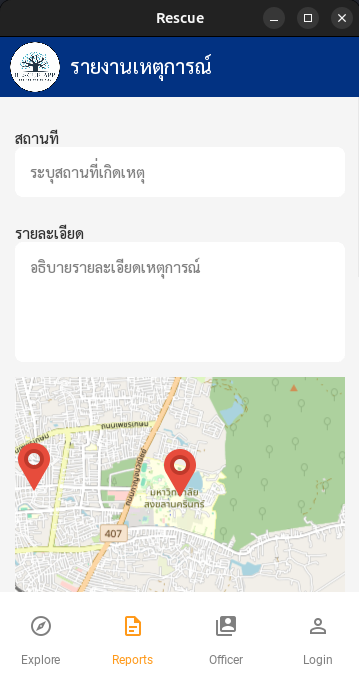

# 🚨 Rescue App

**Rescue App** คือแอปพลิเคชันมือถือที่พัฒนาด้วย **KivyMD** และ **Python** สำหรับการรายงานเหตุฉุกเฉิน แอปนี้ช่วยให้ผู้ใช้สามารถส่งรายงานเหตุด้วยการถ่ายภาพและตำแหน่ง โดยอ้างอิงข้อมูลตำแหน่งมาจาก Public IP เก็บข้อมูลลงใน **MongoDB** พร้อมทั้งแนะนำวิธีการช่วยเหลือผู้ประสบภัย และอธิบายสัญลักษณ์กู้ภัยต่าง ๆ อย่างละเอียด

---

## 📌 คุณสมบัติเด่น

- 📍 **รายงานเหตุฉุกเฉิน:**

  - ถ่ายภาพเหตุการณ์และส่งพร้อมข้อมูลตำแหน่ง Public IP
  - เก็บและจัดการข้อมูลใน MongoDB อย่างมีประสิทธิภาพ

- 🗺️ **แผนที่:**

  - แสดงตำแหน่งของเหตุการณ์บนแผนที่

- 🛟 **คำแนะนำการช่วยเหลือ:**

  - ขั้นตอนการช่วยเหลือผู้ประสบภัยในสถานการณ์ต่าง ๆ
  - อธิบายสัญลักษณ์กู้ภัยและความหมาย

- 🔒 **ระบบยืนยันตัวตน:**
  - ระบบลงทะเบียนและเข้าสู่ระบบที่ปลอดภัย
  - แบ่งสิทธิ์การเข้าถึงระหว่างผู้ใช้ทั่วไปและผู้ดูแลระบบ

---

## 🛠️ เทคโนโลยีที่ใช้

- **Frontend:** KivyMD (Material Design สำหรับ Kivy)
- **Backend:** Python และ MongoDB
- **ฐานข้อมูล:** MongoDB สำหรับจัดเก็บรายงานและข้อมูลผู้ใช้
- **WebCam** openCV2 สำหรับให้งานกล้อง และจัดเก็บใน MongoDB
- **GPS** kivy_garden สำหรับโชว์แผนที่ และตำแหน่งปัจจุบัน

---

## 📂 โครงสร้างโปรเจค

```
RESCUE-APP/
├── fonts/
├── Image/
├── kivy_env/
├── rescue_screen/
├── test_function/
├── main_kivyMD.py
├── .gitignore
└── README.md
```

---

## ⚙️ การติดตั้งและใช้งาน

### 1. Clone โปรเจค:

```bash
git clone https://github.com/PunPK/Rescue-App.git
cd Rescue-App
```

### 2. ติดตั้ง Dependencies:

**สำหรับ macOS และ Linux**

```bash
python3 venv kivy_env
source kivy_env/bin/activate
```

### 3. ติดตั้งแพ็กเกจเพิ่มเติม:

```bash
pip install kivyMD
pip install pymongo
pip install kivy
pip install kivy_garden
pip install gridfs
pip install opencv2
```

### 4. ตั้งค่า MongoDB:

```python
MongoClient("localhost", 27017)
# ใช้งานผ่าน localhost 27017
```

### 5. รันแอป:

```bash
python main_kivyMD.py
```

## หน้าต่างของApp

### หน้า explore
<p align="center">
  
</p>

หน้าexplore จะเป็นหน้าศูนย์รวมการควบคุมประกอบด้วย:
  - View Map Information
  - Safty Tips 
  - Rescure Symbol
  - Sign up Application
  - Application Information
  - Developer CoE36
---
#### หน้า View Map Information
<p align="center">
  
</p>

หน้านี้จะแสดงถึงตำแหน่งปัจจุบันของผู้ใช้งาน


#### หน้า Safty Tips
<p align="center">
  
</p>


หน้านี้จะรวมคลิปวิดีโอวิธีการช่วยเหลือตนเอง
--

#### หน้า Rescure Symbol
<p align="center">
  
</p>

หน้าจะรวมป้ายด้านความปลอดภัย
--

#### หน้า sign up
<p align="center">
  
</p>

หน้าสำหรับการสมัครการใช้งาน
--

#### หน้า Developer CoE36
<p align="center">
  
</p>


เป็นหน้าสำหรับแสดงถึงผู้พัฒนา Application นี้

---
### หน้าส่ง report
<p align="center">
  
</p>

เป็นหน้าที่ใช้ในการส่งreport ซึ่งจะประกอบด้วย
  - สถานที่
  - รายละเอียด
  - ตำแหน่งgps
  - เหตุการณ์
---

### หน้ารวมเบอร์
<p align="center">
  
</p>

หน้านี่จะเป็นหน้ารวมเบอร์ขององค์กรต่างๆที่สามารถโทรเพื่อขอความช่วยเหลือ เช่น 1669 , 191
ประกอบด้วย:
  - เบอร์
  - องค์กร
  - ปุ่มโทร
---

### หน้าlogin สำหรับ admin
<p align="center">
  
</p>

หน้าสำหรับเข้าใช้งานระบบฝั่ง admin
--

### หน้า main
<p align="center">
  
</p>

หน้าจะแสดง report ที่userส่งมาถ้ากดเข้าไปจะประกอบด้วย:
  - สถานที่
  - รายละเอียด
  - ตำแหน่งgps
  - เหตุการณ์

<p align="center">
  
</p>
--

### หน้า Tool Management 
<p align="center">
  
</p>

หน้าจะประกอบด้วยปุ่ม
  - Phone Management ใช้เพื่อ create update delete ข้อมูล
  - Safty Tips Management ใช้เพื่อ create update delete ข้อมูล
  - View team develop แสดงผู้พัฒนา App

#### หน้า Phone Management
<p align="center">
  
</p>

<p align="center">
  
</p>

<p align="center">
  
</p>

หน้า Phone Managent จะประกอบดด้วย3หน้าหลักๆ
  - หน้าสำหรับแสดงผลเบอร์ทุกเบอร์โทรที่มีอยู่ในdb
  - หน้าสำหรับ create เบอร์โทร
  - หน้าสำหรับ edit เบอร์โทร

#### หน้า Safty Tips Management
<p align="center">
  
</p>

<p align="center">
  
</p>

<p align="center">
  
</p>

หน้า Safty Tips Management 
  - หน้าสำหรับแสดงผลSafty-tipsที่มีอยู่ในdbทั้งหมด
  - หน้าสำหรับ create Safty-tip
  - หน้าสำหรับ edit Safty-tip

## 🚨 การใช้งานแอป:

- ลงทะเบียนหรือเข้าสู่ระบบ
- รายงานเหตุด้วยการถ่ายภาพและส่งตำแหน่ง GPS
- ตรวจสอบจุดเกิดเหตุบนแผนที่
- ดูคำแนะนำในการช่วยเหลือผู้ประสบภัย

---

## 🛟 สัญลักษณ์กู้ภัยที่ควรรู้:

- ⚠️ **สัญญาณอันตราย:** ใช้แจ้งเตือนว่ามีอันตรายข้างหน้า
- 🚑 **สัญลักษณ์รถพยาบาล:** บ่งบอกถึงจุดรับส่งผู้ป่วย
- 🔄 **สัญลักษณ์ทางอพยพ:** ช่วยแนะนำทางออกในกรณีฉุกเฉิน

---

## ผู้พัฒนา

### 1. นายกรธัช สุขสวัสดิ์ 6710110005

- **GitHub:** [GitHub Profile](https://github.com/Fishcanwalk)

### 2. นายปุรัสกร เกียรติ์นนทพัทธ์ 6710110270

- **GitHub:** [GitHub Profile](https://github.com/PunPK)

### 3. นายพัฒนชัย พันธุ์เกตุ 6710110280

- **GitHub:** [GitHub Profile](https://github.com/Hopewalk)

---

> 🛠️ **Developed with ❤️ using KivyMD and Python**  
> **240-123 Module Data Structure, Algorithms and Programming ** 🚀
